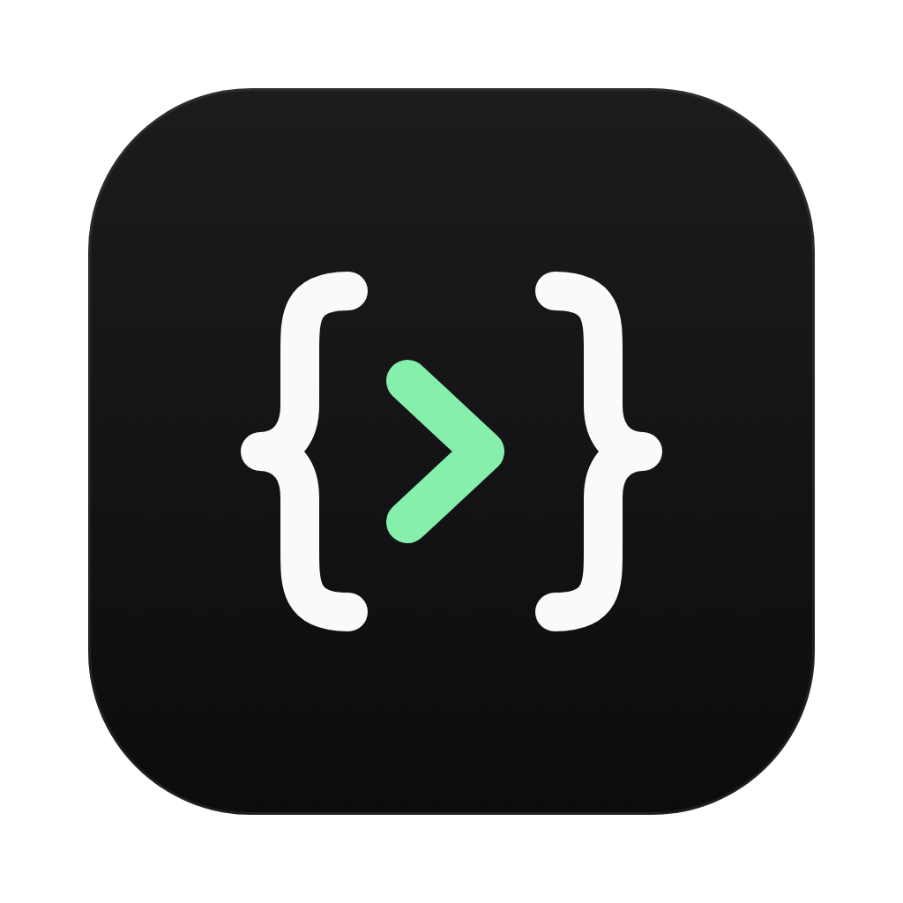
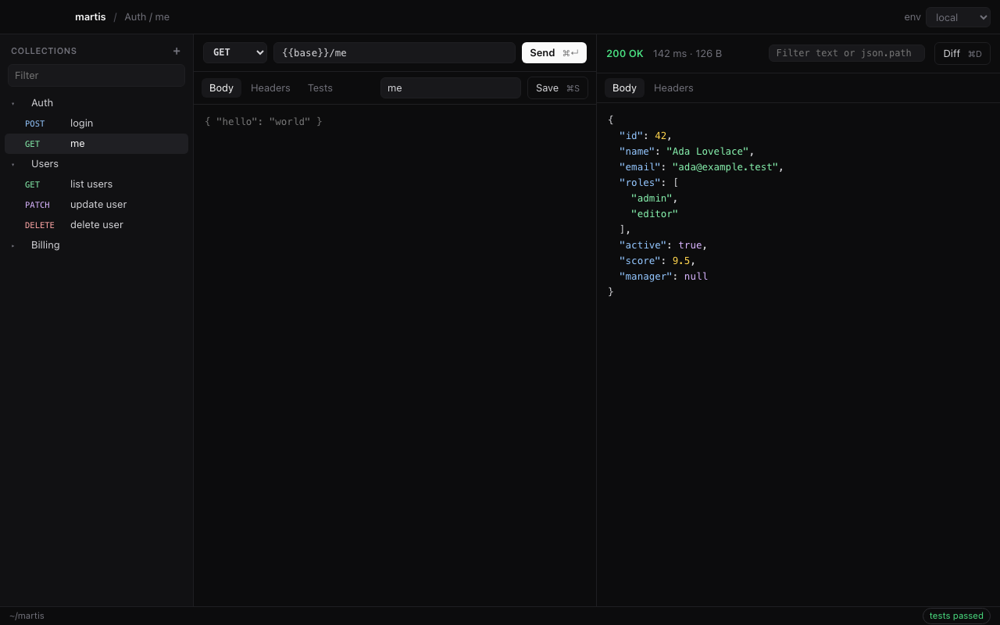
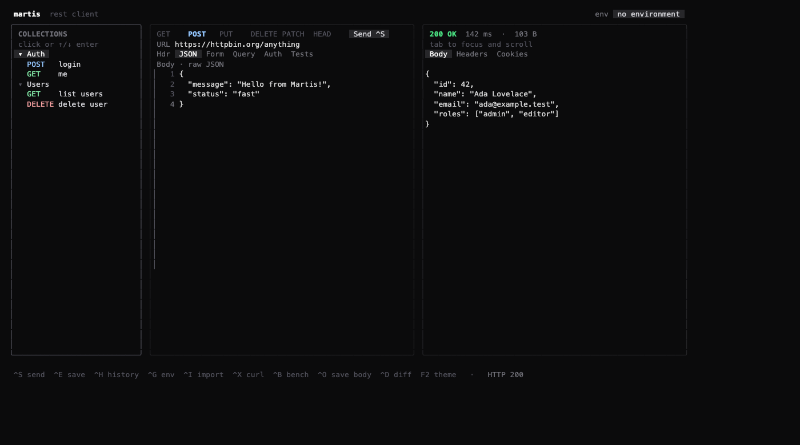

<div align="center">



# Martis

**Lightweight REST client for macOS and Linux.**
A native desktop app and a terminal UI that share the same collections, built with Go. No Electron.

[](https://github.com/wahyuakbarwibowo/martis/releases/latest)
[](https://go.dev)
[](LICENSE)



</div>

```bash
curl -fsSL https://raw.githubusercontent.com/wahyuakbarwibowo/martis/main/install.sh | MARTIS_DESKTOP=1 bash
```

---

## Highlights

- **Dua aplikasi, satu data**: Martis Desktop untuk kerja sehari-hari, TUI untuk terminal dan SSH. Collection dan environment tersimpan di `~/martis`.
- **Ringan**: desktop memakai webview bawaan sistem (unduhan ±4 MB), TUI satu binary statis tanpa dependensi.
- **Request berantai**: simpan nilai response ke variabel (`set token = json.access_token`) lalu pakai `{{token}}` di request berikutnya.
- **Environment & variabel**: file `.env` per environment, `{{variable}}` di URL, header, dan body.
- **Alat bantu response**: format JSON, filter `json.path`, diff dengan response sebelumnya, assertion (`Status == 200`).
- **Import**: Postman collection & environment, OpenAPI 3, dan perintah cURL; export ke cURL.
- **Siap CI**: `martis run --env prod <folder>` menjalankan satu folder dan gagal bila ada assertion yang tidak lolos.
- **Update satu perintah**: `martis update`.

<details>
<summary>Tampilan TUI</summary>



</details>

---

## Instalasi

Martis hadir dalam dua bentuk yang berbagi data yang sama (`~/martis`):

- **Martis Desktop**: aplikasi dengan window sendiri, memakai webview bawaan sistem (tanpa Electron atau Node). Unduhan ±4 MB.
- **`martis` (TUI + CLI)**: untuk terminal, SSH, dan CI (`martis run`).

### macOS

**Pakai skrip (disarankan, gratis, tanpa peringatan Gatekeeper):**

```bash
curl -fsSL https://raw.githubusercontent.com/wahyuakbarwibowo/martis/main/install.sh | MARTIS_DESKTOP=1 bash
```

Skrip memasang `Martis.app` ke `/Applications` (atau `~/Applications` bila tidak punya akses admin) sehingga muncul di Spotlight, Launchpad, dan bisa disematkan ke Dock, serta `martis` dan `martis-desktop` ke PATH.

**Alternatif .dmg:** unduh `Martis_<versi>_arm64.dmg` (Apple Silicon) atau `Martis_<versi>_amd64.dmg` (Intel) dari [Releases](https://github.com/wahyuakbarwibowo/martis/releases/latest), buka, lalu seret **Martis** ke **Applications**. Karena aplikasi belum dinotarisasi Apple, saat pertama kali dibuka klik kanan **Martis → Open**, lalu pilih **Open**.

### Linux

**Debian/Ubuntu (.deb):** unduh `martis-desktop_<versi>_amd64.deb` atau `_arm64.deb` dari [Releases](https://github.com/wahyuakbarwibowo/martis/releases/latest), lalu:

```bash
sudo apt install ./martis-desktop_*.deb
```

**Distro lain (skrip):**

```bash
curl -fsSL https://raw.githubusercontent.com/wahyuakbarwibowo/martis/main/install.sh | MARTIS_DESKTOP=1 bash
```

Skrip menambahkan Martis ke menu aplikasi. Aplikasi desktop butuh WebKitGTK 4.1: `sudo apt install libwebkit2gtk-4.1-0` (Debian/Ubuntu) atau `sudo dnf install webkit2gtk4.1` (Fedora).

### TUI saja

```bash
curl -fsSL https://raw.githubusercontent.com/wahyuakbarwibowo/martis/main/install.sh | bash
```

Tersedia untuk macOS, Linux, dan (via [Releases](https://github.com/wahyuakbarwibowo/martis/releases/latest)) Windows. Skrip memverifikasi checksum dan memasang ke `/usr/local/bin` (atau `~/.local/bin`). Atur `VERSION=v0.6.0` untuk versi tertentu atau `INSTALL_DIR=...` untuk lokasi lain. Alternatif: `go install github.com/wahyuakbarwibowo/martis@latest`.

### Dari Source

```bash
git clone https://github.com/wahyuakbarwibowo/martis.git
cd martis
make install        # pasang TUI ke /usr/local/bin
make desktop-run    # build lalu buka aplikasi desktop (butuh CGO)
make desktop-app    # kemas Martis.app + .dmg (macOS) atau .deb (Linux) ke dist/
```

Build desktop butuh Xcode Command Line Tools di macOS, atau `libgtk-3-dev` + `libwebkit2gtk-4.1-dev` di Linux (tambahkan tag `webkit2_41`).

---

## Cara Membuka

### Martis Desktop

- **macOS:** tekan `⌘ Space`, ketik **Martis**, Enter. Atau buka dari Launchpad/Applications, atau jalankan `martis-desktop` di terminal.
- **Linux:** cari **Martis** di menu aplikasi, atau jalankan `martis-desktop`.

Shortcut: `⌘↵` kirim, `⌘S` simpan, `⌘D` diff dengan response sebelumnya, `⌘F` filter (`json.path` atau teks), `⇧⌘F` rapikan body JSON, `⌘N` request baru. Di Linux gunakan `Ctrl` sebagai pengganti `⌘`.

### TUI dan CLI

```bash
martis                                   # buka TUI
martis https://api.example.com/users     # buka TUI dengan URL ini
martis curl -H 'Accept: application/json' https://api.example.com   # dari perintah cURL
martis run --env prod Auth               # jalankan folder "Auth" tanpa UI (untuk CI)
```

Keluar dengan `q` atau `Ctrl+C`. Semua shortcut TUI ada di bagian Keyboard Shortcuts di bawah.

---

## Keyboard Shortcuts

| Shortcut | Aksi |
|---|---|
| `Tab` / `Shift+Tab` | Pindah fokus antar elemen UI |
| `Ctrl+P` | **Buka modal Collections** (pilih / muat / hapus request tersimpan) |
| `Ctrl+N` | Buat folder collection |
| `Ctrl+E` | **Simpan request aktif ke Collection** |
| `Ctrl+T` | Ganti tab konfigurasi request (*Headers* / *Raw JSON* / *Form-Data*) |
| `Ctrl+I` | Impor cURL dari clipboard; jika clipboard kosong, buka editor impor |
| `Ctrl+F` | Buka Finder untuk memilih file lokal saat tab Form-Data aktif |
| `Ctrl+X` | Ekspor request aktif sebagai perintah cURL ke clipboard |
| `Ctrl+H` | Pilih request dari history |
| `Ctrl+G` | Pilih file environment `.env` |
| `F2` | Pilih tema |
| `F3` | Pilih preset autentikasi |
| `/` | Cari teks di response, atau filter JSON dengan `json.data.0.id` |
| `Ctrl+D` | Bandingkan (diff) response saat ini dengan response sebelumnya |
| `Ctrl+Y` / `Ctrl+O` | Salin response / simpan ke file |
| `Ctrl+B` | Jalankan benchmark request |
| `F4` | Rapikan (format) body JSON request |
| `Ctrl+S` | Kirim HTTP Request |
| `Enter` | Kirim request (saat di URL bar / Send button) atau Konfirmasi modal |
| `d` / `Backspace` | Hapus request terpilih di sidebar atau modal Collection |
| `r` | Rename folder atau request terpilih di sidebar |
| `m` | Pindahkan request terpilih ke folder lain |
| `←` / `→` | Ganti HTTP Method (*GET*, *POST*, *PUT*, *DELETE*, *PATCH*, *HEAD*) |
| `↑` / `↓` / `j` / `k` | Scroll response viewer (saat fokus di viewport) atau navigasi Collection |
| `q` / `Ctrl+C` | Keluar dari aplikasi |

---

## CLI Commands

```bash
martis             # Buka antarmuka TUI
martis collections # Tampilkan daftar request di collection
martis import api.json # Impor Postman v2, OpenAPI 3, atau environment Postman
martis run --env prod Auth   # Jalankan semua request di folder "Auth" (exit 1 jika ada yang gagal, cocok untuk CI)
martis https://api.test/users  # Buka TUI dengan URL tersebut
martis curl -H 'X-A: b' https://api.test  # Buka TUI dengan request dari perintah cURL
martis version     # Tampilkan versi terpasang
martis update      # Perbarui ke rilis terbaru (termasuk aplikasi desktop bila terpasang)
martis help        # Tampilkan ringkasan bantuan
```

---

## Roadmap & Kontribusi
Pada tab Form-Data, isi satu baris per field (`name=value`) atau file (`@avatar=/path/to/avatar.png`). Impor cURL mendukung method, URL, headers, autentikasi dasar, body file (`--data-binary @file`), dan banyak field form-data/file (termasuk atribut MIME seperti `;type=image/png`). Pada macOS, tekan `Ctrl+F` atau klik editor file untuk membuka Finder dan memilih file lokal; platform lain memakai picker internal. File environment disimpan di `~/martis/environments/`; gunakan `{{variable}}` pada URL, header, atau body.

Tab Assertions menerima satu baris per aturan:

```text
Status == 200
json.data.id != nil
set token = json.access_token
```

Baris `set` menyimpan nilai dari response ke environment aktif, sehingga request berikutnya bisa memakai `{{token}}` (juga berlaku saat `martis run`). Response di atas 1 MB tidak langsung ditampilkan: tekan `Enter` di panel response untuk tetap menampilkan, `/` untuk filter, atau `Ctrl+O` untuk menyimpan ke file.

Kontribusi dan pull request selalu disambut dengan baik!

---

## Lisensi
Didistribusikan di bawah lisensi [MIT](LICENSE).
